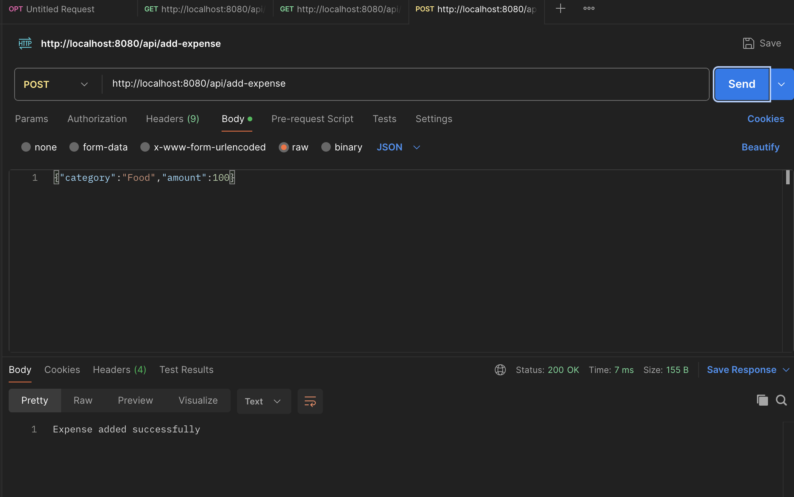
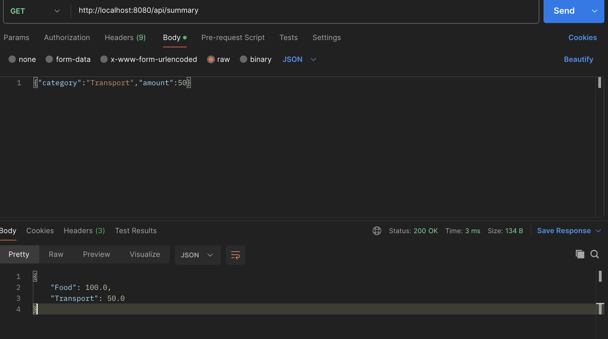
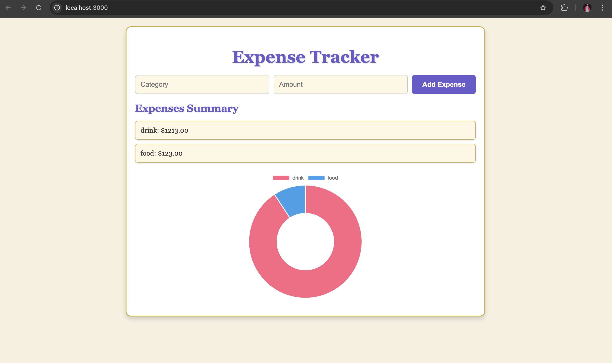

# Expense Tracker Backend

This is the backend for the Expense Tracker application. It is built using C++ and provides APIs to add expenses and retrieve a summary of expenses.

## Features
- Add expenses via a POST request.
- Retrieve a summary of expenses via a GET request.
- CORS support for frontend integration.

---

## Prerequisites

Before setting up the backend, ensure you have the following installed on your system:
1. **C++ Compiler**: `clang` or `gcc` (C++17 or later).
2. **CMake**: Version 3.10 or later.
3. **Build Tools**: `make` or equivalent.
4. **Dependencies**:
   - `cpp-httplib` (for HTTP server functionality).
   - `nlohmann/json` (for JSON parsing).

---

## Setup Instructions

Follow these steps to set up and run the backend:

<!-- ### 1. Clone the Repository
Clone the project repository to your local machine:
```bash
git clone <repository-url>
cd backend -->

2. Install Dependencies
Ensure the required dependencies (cpp-httplib and nlohmann/json) are available in the include directory:

httplib.h should be in include/.
nlohmann/json should be in include/nlohmann/.
If they are missing, download them:

cpp-httplib
nlohmann/json
3. Build the Project
Create a build directory and compile the project:

mkdir -p build
cd build
cmake ..
make

4. Run the Backend
Run the compiled executable:

./expense_tracker

You should see the following message:

Starting server on http://localhost:8080

API Endpoints
1. Add Expense
Endpoint: /api/add-expense
Method: POST
Request Body:

{
    "category": "Food",
    "amount": 100.0
}


Response:
Success: Expense added successfully
Error: 400 Bad Request
2. Get Summary
Endpoint: /api/summary
Method: GET
Response:

{
    "Food": 100.0,
    "Transport": 50.0
}

## final webpage
